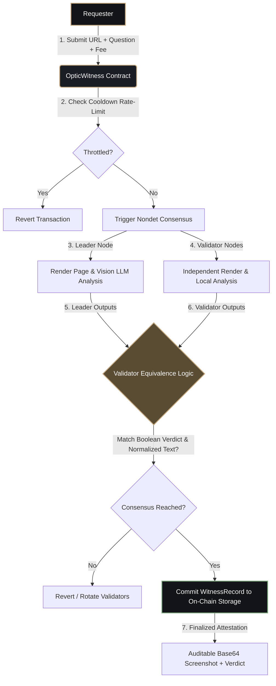

# OpticWitness

**Decentralized, Spam-Protected, and Consensus-Backed Web Content Notarization**

OpticWitness is a premium Layer 1 Intelligent Contract solution built on the GenLayer protocol. It transforms transient webpage layouts and visual claims into immutable, cryptographically secure, and publicly auditable on-chain proof. 

Through visual AI consensus, OpticWitness validates what a webpage displays in real-time, defending against silent updates to terms of service, false audits, hidden APY claims, and fake screenshots.

---

## Technical Flow Overview



```
               \______/
               (_  __ )
               (o) (o)       / \ 
              /       \     /   \  [DRAGON EYE OF CONSENSUS]
             /  |   |  \   /     \
            |   |   |   | /       \  "Witnessing Web States"
            |   |   |   |/         \  "On-Chain & Tamper-Proof"
             \  |   |  /            \
              \_______/              \
                 | |__________________|
                 | |
                 | |==>[Submit URL]=======>[Visual Render]========>[Consensus Verdict]
                 |_|
```

---

## Architectural Enhancements

OpticWitness improves upon previous L1 visual scrapers through several key design choices:

1. **Cooldown-Based Rate Limiting**
   Prevents malicious spamming and validator resource draining by enforcing a mandatory 60-second cooldown per sending address between requests. Time calculations are governed in a secure, clock-drift-free manner using transactional ISO metadata timestamps.

2. **Alphanumeric Text Normalization**
   Validator nodes compare extracted text by sanitizing spacing, punctuation, and casing (reducing comparisons to strict alphanumeric sequences). This mitigates false consensus splits caused by minor, trivial formatting discrepancies in the LLM's response.

3. **Exclusion of Binary Image Hashes from Consensus**
   Different validator nodes rendering the same page will naturally encounter slight pixel variances (e.g. cursor blinks, layout offsets, dynamic ads). OpticWitness skips strict byte-level image hash matching in the validation loop, focusing consensus on semantic outcomes, while storing the leader's image on-chain for public auditability.

4. **Self-Contained Audit Trail**
   Stores the leader's screenshot directly in the transaction payload as base64 data. Anyone can reconstruct the exact visual proof off-chain and hash it to confirm integrity against the stored SHA-256 screenshot hash.

---

## Repository Structure

```
├── contracts/
│   └── optic_witness.py      # Intelligent Contract (state, cooldowns, validator checks)
├── tests/
│   └── direct/
│       ├── conftest.py       # Pytest fixtures for PIL image mocking
│       └── test_optic_witness.py # Unit tests (fees, cooldowns, consensus splits)
├── scripts/
│   └── deploy.mjs            # Automated deploy script for StudioNet
└── frontend/
    ├── package.json          # Dependency configurations
    ├── vite.config.ts        # Bundler configuration
    ├── index.html            # Main markup page (Syne & Sora font bindings)
    └── src/                  # React dashboard codebase
```

---

## Local Setup & Development

### Contract Validation & Testing
Run contract linting and verification tests locally using the direct-testing framework:
```bash
# Execute direct unit tests
pytest tests/direct/ -v
```

### StudioNet Deployment
Deploy the contract to GenLayer StudioNet:
1. Create a `.env` file in the root directory:
   ```env
   ACCOUNT_PRIVATE_KEY=0xyourprivatekeyhere
   FEE_WEI=0
   ```
2. Run the deployment script:
   ```bash
   npm install
   npm run deploy
   ```

### Frontend Compilation
1. Copy the output contract address and configure the frontend variables in `frontend/.env`:
   ```env
   VITE_PRIVY_APP_ID=yourprivyappid
   VITE_CONTRACT_ADDRESS=0xdeployedcontractaddress
   ```
2. Build and launch the React client:
   ```bash
   cd frontend
   npm install
   npm run dev
   ```

---

## License

This project is licensed under the MIT License.
